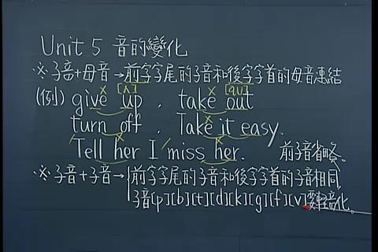
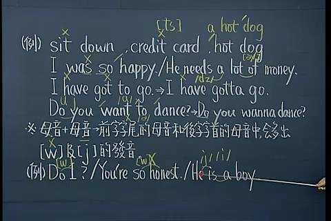
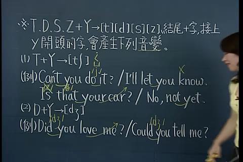
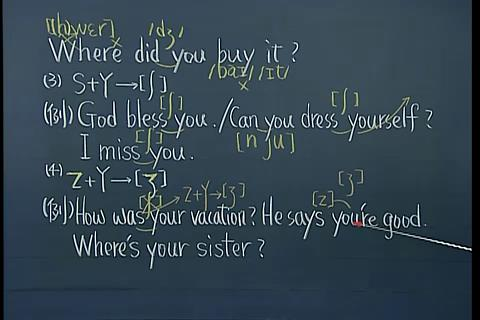
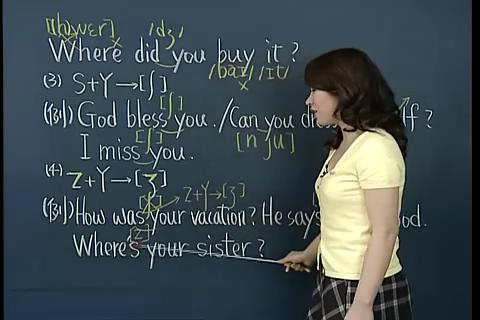

# 音的变化
##### 子音 + 母音 -> 前字字尾的子音和后字字首的母音连接
(例) 

 
##### 子音 + 子音 ->
#####  1前字字尾的子音和后字字首的字子音相同， 前子音省略。 
#####  2 子音[ p ][ b ] [ t ] [ d ] [ k ] [ g ] [ f ] [ v ]要轻音化  
###(例)

#### 母音+母音-> 前字字尾的母音和后字字首的母音种中，会念出[w] 及 [ j ]的发音

#### T D S Z + Y -> [t] [d] [s] [z]结尾+字，接上y开头的字，会产生下列音变

