# 一  storyboard文件的认识
###### 作用：描述软件界面的
###### 应用程序的启动原理
1. 当应用程序启动的时候，首先会加载一个storyboard
2. 加载storyboard里面的控制器：箭头所指向的控制器
3. 控制器会创建（加载）一个属于控制器的view

###### 配置程序一启动就会加载Main.storyboard文件
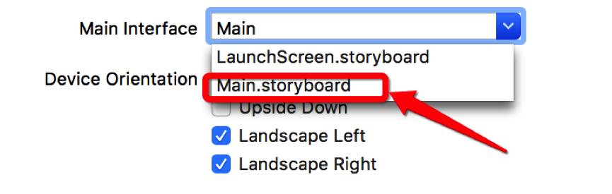

---

# 二 UIViewController

###### 概念:凡是继承自UIViewController的对象,都叫做控制器
###### 注意:每一个控制器都会专门管理一个软件界面
###### 作用:负责处理软件界面的各种事件,并负责软件界面的创建和销毁
---

# 三 IBAction
###### 只能修饰方法返回值类型
###### 被IBAction修饰的方法

1. 能拖线到storyboard中

2. 返回值类型实际是void


只有返回值声明为IBAction的方法，才能跟storyboard中的控件进行连线

##### 使用格式 -(IBAction)buttonClick{}
--- 
# 四 IBOutlet
###### 只能修饰属性
###### 被IBOutlet修饰的属性
能拖线到storyboard中
###### 使用格式
```objc
@property(nonatomic, weak)IBOutlet UILabel *label
```
只有声明为IBOutlet的属性，才能跟storyboard中的控件进行连线

---

# 五 关于IBAction和IBOutlet前缀IB的解释
#### IB全称:Interface Builder
##### 以前UI界面开发模式:Xcode + Interface Builder
##### 从Xcode4开始,Interface Builder已经整合到Xcode中
##### 面试要求:熟练Interface Builder
---
# 六 类扩展
## 作用
##### 能为某个类增加额外的属性,成员变量,方法声明
###### 一般将类扩展写到.m文件中
#### 使用格式
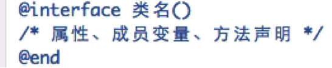
#### 与分类的区别
##### 分类的小括号必须有名字
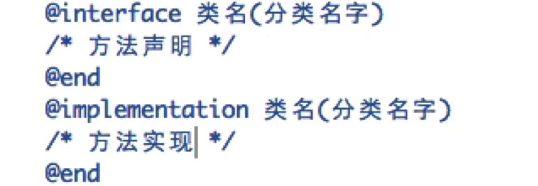
##### 分类只能扩充方法
##### 如果在分类中声明了一个属性,分类只会生成这个属性的get\set方法的声明,不会有实现
---
# 设置程序启动时加载的storyboard
这个设置表明：程序启动时会加载Main.storyboard
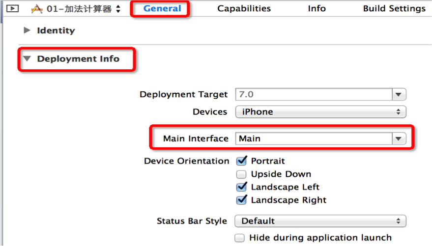

---
# 七 常见的错误
##### 错误1
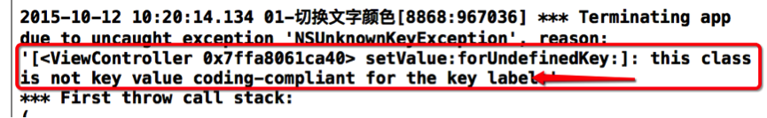
###### 原因:属性代码被删掉了,但是属性连线还在
解决:删除多余的连线

##### 错误2
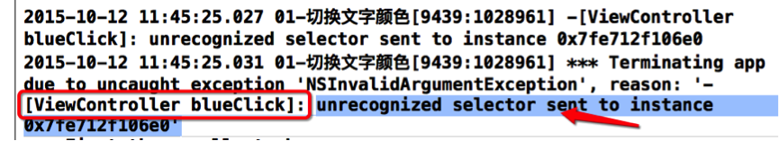
###### 原因:调用了一个不存在的方法
解决:认真检查方法名,使用正确且存在的方法名
---

# UIView
苹果将控件的共同属性都抽取到父类UIView中
所有的控件最终都继承自UIView
UIButton、UILabel都是继承自UIView（可以查看头文件）
##### UIView的常见属性
@property(nonatomic,readonly) UIView *superview;
 获得自己的父控件对象

@property(nonatomic,readonly,copy) NSArray *subviews;
 获得自己的所有子控件对象

@property(nonatomic) NSInteger tag;
 控件的ID(标识)，父控件可以通过tag来找到对应的子控件

@property(nonatomic) CGAffineTransform transform;
 控件的形变属性(可以设置旋转角度、比例缩放、平移等属性)

##### UIView的常见方法
- (void)addSubview:(UIView *)view;
 添加一个子控件view

- (void)removeFromSuperview;
 将自己从父控件中移除

- (UIView *)viewWithTag:(NSInteger)tag;
 根据一个tag标识找出对应的控件（一般都是子控件）

##### UIView的常见属性
@property(nonatomic) CGRect frame;
 控件矩形框在父控件中的位置和尺寸(以父控件的左上角为坐标原点)

@property(nonatomic) CGRect bounds;
 控件矩形框的位置和尺寸(以自己左上角为坐标原点，所以bounds的x、y一般为0)

@property(nonatomic) CGPoint center;
 控件中点的位置(以父控件的左上角为坐标原点)
 
---

# 父控件、子控件
每一个控件其实都是一个容器
可以将其他控件放到该控件的内部
比较常见的还是将UIView作为容器

可以将A控件放入B控件
A控件是B控件的子控件
B控件是A控件的父控件

每一个控制器都有一个UIView
控制器本身是不可见
能够看到的是控制器的View
每一个控制器中都一个UIVIew的属性
控制器中管理的所有子控件都是该控件的子控件
# UIKit坐标系
在UIKit中，坐标系的原点(0，0)在左上角，x值向右正向延伸，y值向下正向延伸
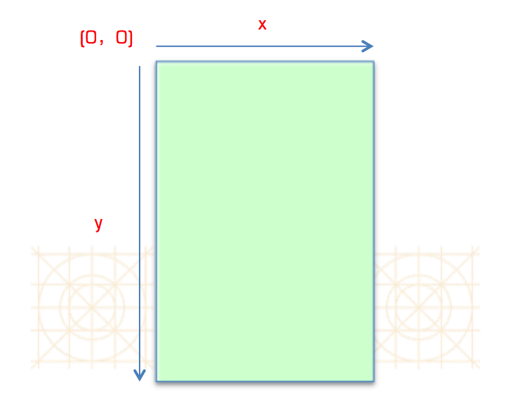


# UILable
### UILabe 属性
    ```objc
    // 改变文本中文字的颜色
        self.label.textColor = [UIColor redColor];
    // 改变文本的内容
        self.label.text = @"我是一段红擦擦的文字";
    // 改变背景的颜色
        self.label.backgroundColor = [UIColor blackColor];
    // 文字居中
        self.label.textAlignment = NSTextAlignmentCenter;
    // 改变文字的大小
        self.label.font = [UIFont systemFontOfSize:20.0];
     // 改变红色按钮的背景颜色
        self.redBtn.backgroundColor = [UIColor redColor];

    ```

### UI控件响应事件移除拖线连接

#### 第一步

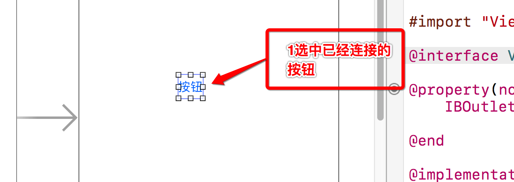

#### 第二步


### UI控件响应事件拖线连接的三种方式

#### 第一种

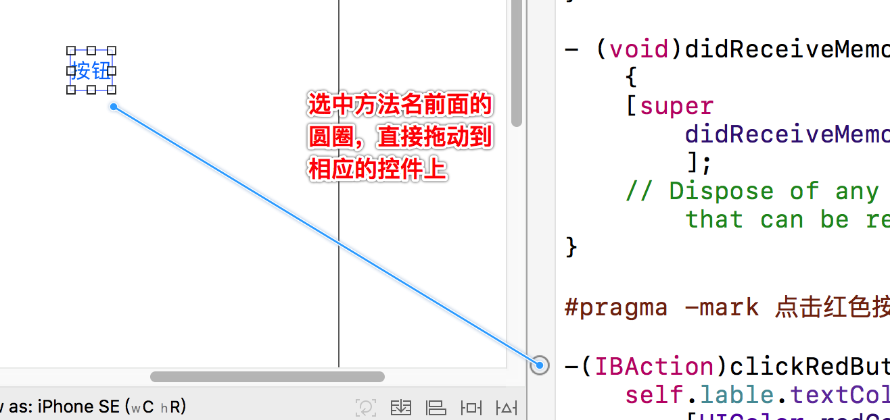

#### 第二种

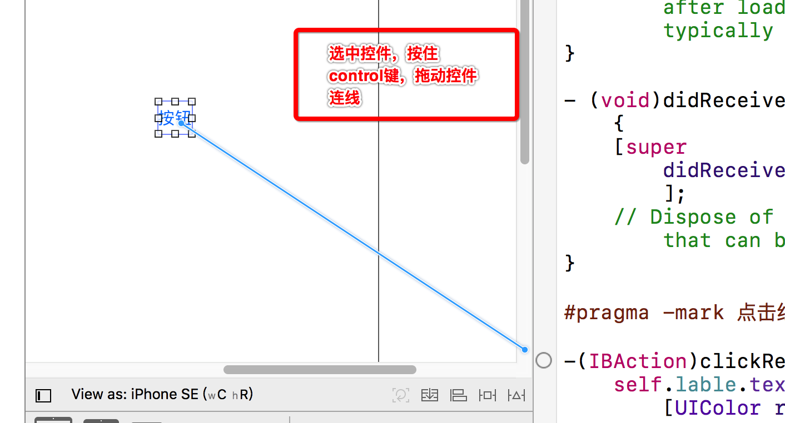

#### 第三种

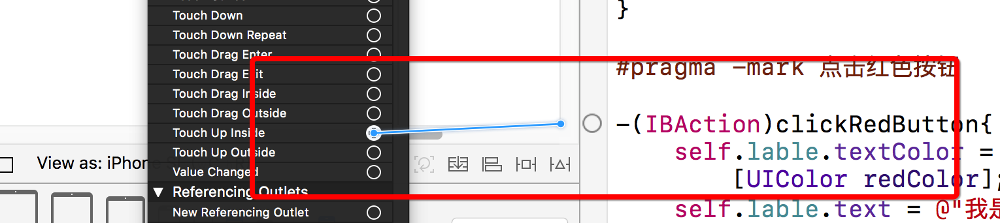

### 可连线的UI控件直接拖到ControlView 的空白处，弹出创建方法对话框

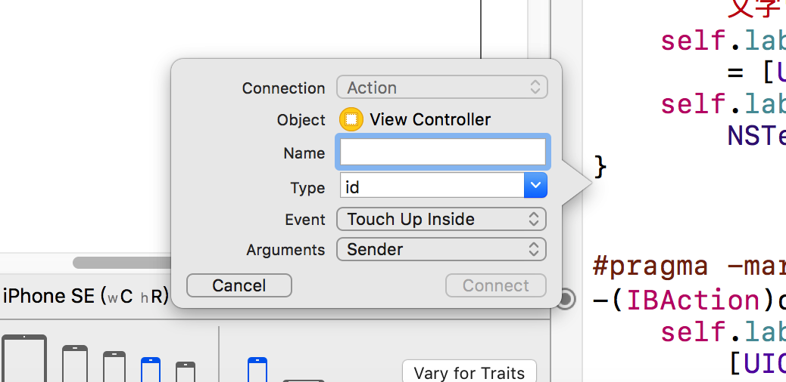

### 注意

* 只有sendevent事件的对象才能连线方法
* 继承自UIControl对象的才能连线
* 一个控件可以对应多个事件 
* 一个控件也可以对应多个个属性，但尽量不要这么做

### 连线常见错误

####注意事项:
   1.凡是继承UIControl的类产生的对象,都能够实现点击
   2.如果不是继承UIControl的类产生的对象,都能不够实现点击
 
   经典的错误:
   一.错误一:
     描述: 
     reason: '[<MainViewController 0x7fd133746de0> setValue:forUndefinedKey:]: this class is not key value coding-compliant for the key testLabel.'
     原因: 有多余的连线
     解决: 删除多余的联系
 
  二.错误二
     描述:
     reason: '-[MainViewController clickRedBtn:]: unrecognized selector sent to instance 0x7f7f9254bee0'
     原因:在控制器中找不到对应的方法
     解决:  (一) 增加对应的方法  (二)删除多余的连线

---
# UIView

### UIView常见属性

    ```objc 
        @property(nonatomic,readonly) UIView *superview;
         获得自己的父控件对象
        
        @property(nonatomic,readonly,copy) NSArray *subviews;
         获得自己的所有子控件对象
        
        @property(nonatomic) NSInteger tag;
         控件的ID(标识)，父控件可以通过tag来找到对应的子控件
        
        @property(nonatomic) CGAffineTransform transform;
         控件的形变属性(可以设置旋转角度、比例缩放、平移等属性)
        - (void)addSubview:(UIView *)view;
         添加一个子控件view
        
        - (void)removeFromSuperview;
         将自己从父控件中移除
        
        - (UIView *)viewWithTag:(NSInteger)tag;
         根据一个tag标识找出对应的控件（一般都是子控件）
        
        - (void)loadView{
          [super loadView];
        //  NSLog(@"%s", __func__);
        }
        
        /*
           1.当控制器的view加载完毕的时候调用
           2.系统自动调用
           3.控件的初始化操作,数据的初始化
         */
        - (void)viewDidLoad {
            [super viewDidLoad];
        
            // 1.1 查看红色的View的父控件
        //    NSLog(@"红色的View:%@------控制器的View:%@", self.redView.superview, self.view);
            
            // 1.2 查看红色的View的子控件
        //    NSLog(@"红色的view的子控件:%@", self.redView.subviews);
            
            // 1.3 查看控制器的View的子控件
        //      NSLog(@"控制器的View的子控件:%@", self.view.subviews);
            
            // 1.4 控制器的view的父控件
              NSLog(@"%@", self.view.superview);
            
        }
        
        /*
           控制器的View已经完全显示
           系统调用
         */
        - (void)viewDidAppear:(BOOL)animated{
            [super viewDidAppear:animated];
            
            // 1.4 控制器的view的父控件 ---> UIWindow
            NSLog(@"%@", self.view.superview);
        }
        
        
        /*
          1. 当控制器接收到内存警告时候调用
          2. 系统自动调用
          3. 处理调用一些不必要的内存和一些耗时的内存
         */
        - (void)didReceiveMemoryWarning {
            [super didReceiveMemoryWarning];
        }

    ```


