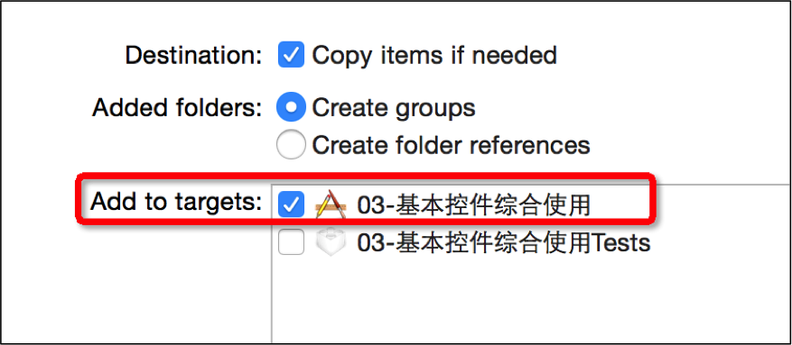

#UIButton
### UIButton五种的状态
#### normal（普通状态）
默认情况（Default）
对应的枚举常量：UIControlStateNormal

#### highlighted（高亮状态）
按钮被按下去的时候（手指还未松开）
对应的枚举常量：UIControlStateHighlighted

#### disabled（失效状态，不可用状态）

如果enabled属性为NO，就是处于disable状态，代表按钮不可以被点击
对应的枚举常量：UIControlStateDisabled

---

### 用代码创建UIButton
    //在用代码创建按钮的同时指定按钮样式
    UIButton *btn = [UIButton buttonWithType:UIButtonTypeCustom]; 
    UIButtonTypeCustom：无类型，按钮的内容需要自定义
    UIButtonTypeDetailDisclosure： 
    UIButtonTypeInfoLight： 
    UIButtonTypeInfoDark： 
    UIButtonTypeContactAdd： 

### UIButton的常见设置
    - (void)setTitle:(NSString *)title forState:(UIControlState)state;
    设置按钮的文字
    
    - (void)setTitleColor:(UIColor *)color forState:(UIControlState)state;
     设置按钮的文字颜色
    
    - (void)setImage:(UIImage *)image forState:(UIControlState)state; 
    设置按钮内部的小图片
    
    - (void)setBackgroundImage:(UIImage *)image forState:(UIControlState)state;
    设置按钮的背景图片
    
    设置按钮的文字字体（需要拿到按钮内部的label来设置）
    btn.titleLabel.font = [UIFont systemFontOfSize:13];
    
    - (NSString *)titleForState:(UIControlState)state; 
    获得按钮的文字
    
    - (UIColor *)titleColorForState:(UIControlState)state;
    获得按钮的文字颜色
    
    - (UIImage *)imageForState:(UIControlState)state;
    获得按钮内部的小图片
    
    - (UIImage *)backgroundImageForState:(UIControlState)state;
    获得按钮的背景图片

    
### UIButton、UIImageView、UILabel的选择

选择
仅仅是显示数据，不需要点击
建议选择UIImageView、UILabel

不仅显示数据，还需要监听点击
建议选择UIButton
其实UIImageView、UILabel也可以通过手势识别器来监听（后面课程会学）

长按控件后，会改变显示的内容
不用考虑了，选择UIButton（因为UIButton有highlighted这种状态）

同时显示2张图片：背景图片、内容图片
不用考虑了，选择UIButton

---

# Plist文件

### 什么是Plist文件
直接将数据直接写在代码里面，不是一种合理的做法。如果数据经常改，就要经常翻开对应的代码进行修改，造成代码扩展性低

因此，可以考虑将经常变的数据放在文件中进行存储，程序启动后从文件中读取最新的数据。如果要变动数据，直接修改数据文件即可，不用修改代码

一般可以使用属性列表文件存储NSArray或者NSDictionary之类的数据，这种“属性列表文件”的扩展名是plist，因此也称为“plist文件”

### 解析Plist文件
    
    获得Plist文件的全路径
    NSBundle *bundle = [NSBundle mainBundle];
    NSString *path = [bundle pathForResource:@"shops" ofType:@"plist"];
    
    加载plist文件
    _shops = [NSArray arrayWithContentsOfFile:path];

### Plist的使用注意
plist的文件名不能叫做“info”、“Info”之类的

添加plist等文件资源的时候，一定要勾选下面的选项

---

# 懒加载
 1.作用:
    1>用到的时候再加载
    2>全局只会被加载一次
    3>全局都可以使用
 
    过程:
    1.重写成员变量的get方法
    2.在get方法中判断:
      1>如果为空,加载数据
      2>如果不为空,就直接返回数据
---

# 用模型取代字典的好处
### 使用字典的坏处
一般情况下，设置数据和取出数据都使用“字符串类型的key”，编写这些key时，编辑器没有智能提示，需要手敲
dict[@"name"] = @"Jack";
NSString *name = dict[@"name"];
手敲字符串key，key容易写错
Key如果写错了，编译器不会有任何警告和报错，造成设错数据或者取错数据
### 使用模型的好处
所谓模型，其实就是数据模型，专门用来存放数据的对象，用它来表示数据会更加专业
模型设置数据和取出数据都是通过它的属性，属性名如果写错了，编译器会马上报错，因此，保证了数据的正确性
使用模型访问属性时，编译器会提供一系列的提示，提高编码效率
app.name = @"Jack";
NSString *name = app.name;
### 字典转模型
字典转模型的过程最好封装在模型内部

模型应该提供一个可以传入字典参数的构造方法
    - (instancetype)initWithDict:(NSDictionary *)dict;
    + (instancetype)xxxWithDict:(NSDictionary *)dict;

### instancetype
instancetype在类型表示上，跟id一样，可以表示任何对象类型

instancetype只能用在返回值类型上，不能像id一样用在参数类型上

instancetype比id多一个好处：编译器会检测instancetype的真实类型

---

### 类前缀
使用Objective-C开发iOS程序时，最好在每个类名前面加一个前缀，用来标识这个类的“老家”在哪

目的是防止N个人开发了一样的类，冲突了
比如Jake Will、Kate Room在同一个项目中都各自开发了个Button类，这样的程序是不能运行起来的
解决方案：Jake Will的类名叫做JWButton，Kate Room的类名叫做KRButton

