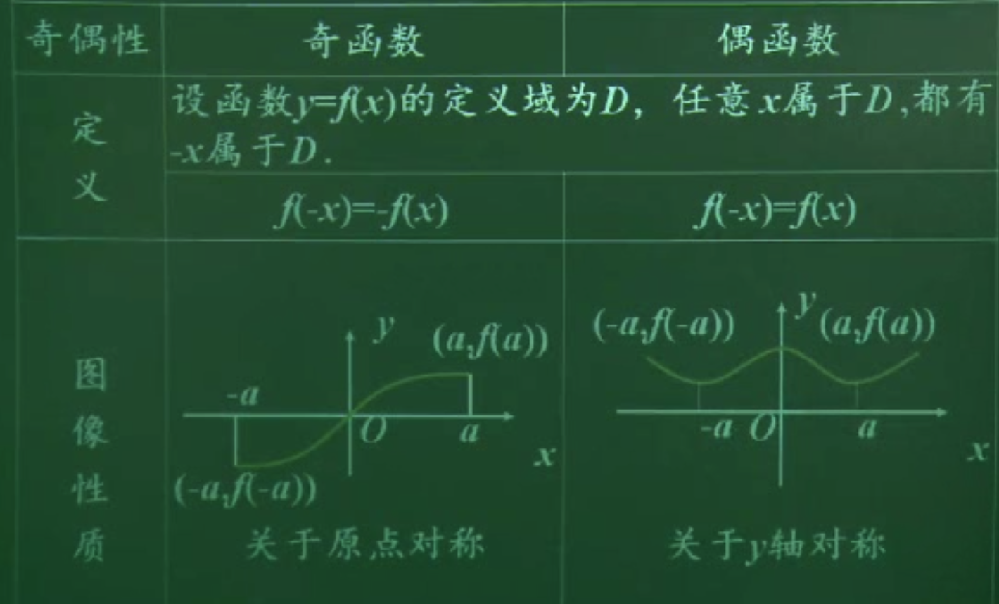

## 函数的奇偶性

#### 偶函数定义

一般地，如果对函数f\(x\)的定义域内的任意一个x,都有f\(-x\) = f\(x\),那么函数f\(x\) 就叫偶函数  
$$f(-x) = f(x)$$

#### 奇函数

一般地，如果对函数f\(x\)的定义域内的任意一个x,都有f\(-x\) = -f\(x\),那么函数f\(x\) 就叫奇函数  
$$f(-x) = -f(x)$$  

##### 奇偶函数对比
| 函数 $$ f(x)$$ 是偶函数  | 函数$$f(x)$$的图像关于Y轴对称  | 对函数$$f(x)$$ 的定义域的任意一个自变量x都有$$ f(-x) = f(x)$$|  
| :--- | :--- |:--- |
| 函数 $$ f(x)$$ 是奇函数  | 函数$$f(x)$$的图像关于原点对称  | 对函数$$f(x)$$ 的定义域的任意一个自变量x都有$$ f(-x) = -f(x)$$|

##### 例题：判断下面函数的奇偶性
1$$f(x) = x + \frac{1}{x}$$
解：定义域$$(- \infty, 0)\bigcup(0, +\infty) = D$$
依题$$x \in D$$
$$f(-x) = (-x)+\frac{1}{(-x)}$$
$$=-(x + \frac{1}{x})$$
$$=f(x)$$
$$\therefore f(x)$$为奇函数 

2$$f(x) = -x^2 + 2$$
解：定义域$$x \in R$$
$$f(-x) = -(-x)^2 +2$$
$$ = -x^2 +2$$
$$ =f(x) $$
$$\therefore f(x)为偶函数$$

3对于普通的奇偶函数判断
3 $$f(x) = \frac{ \sqrt[]{1-x^2}}{|x+2|-2}$$
分析：求f(x) 的定义域-> 
$${1-x^2 \geq 0} ==> -1 \leq x \leq 1 $$
$$\therefore |x+2| \neq 0 即 |x+2|-2 = (x+2)-2 \neq 0$$
$$  x \neq 0$$
解：
$$ f(x) 的定义域为[-1, 0)\bigcup（0,1]$$

$$\because f(x) =  \frac{ \sqrt[]{1-x^2}}{|x+2|-2} = = \frac{ \sqrt[]{1-x^2}}{(x+2)-2}= \frac{ \sqrt[]{1-x^2}}{x}$$
$$\therefore f(-x) =  \frac{ \sqrt[]{1-(-x^2)}}{-x}= -\frac{ \sqrt[]{1-x^2}}{x} \therefore f(x)是奇函数$$

4 $$设f(x)是定义域在R上的奇函数，当x>0时， f(x) = 2x+1，当 x< 0时，求 f(x)的解析式$$
解析:f(x) 为分段函数 定义域在R，的奇函数
解：当x > 0, -x < 0
f(-x) = -f(x)
$$f(x) = -f(-x) = -[(2(-x)+1)]=2x-1$$
$$\therefore f(x) = 2x+1 x> 0$$
$$ f(x) = 0, x = 0$$
$$f(x) = 2x -1, x < 0$$

5
$$f(x) = x(1-x), x < 0 $$
$$f(x) = x(1 + x) ,x >0$$
解： f(x) 的定义域为$$(-\infty,0 ) \bigcup (0, +\infty)$$
当x>0, f(x) = x(1+x)
-x< 0,f(-x) = -x(1+(-x)) =-x(1-x)= -f(x)  
当x < 0, f(x) = x(1-x)
-x > 0, f(-x) = -x(1-(-x)) = -x(1+x) = -f(x)
$$\therefore 综上，x \in (-\infty,0 ) \bigcup (0, +\infty)都有f(-x) = -f(x),即f(x)为奇函数$$
# 奇偶性的应用
|函数具有奇偶性|其定义域一定有关于原点对称|
| :--- |:--- |
|定义域不关于原点对称|该函数一定不具有奇偶性|
|判断函数奇偶性|定义域优先|
奇函数+奇函数= 奇函数
偶函数+ 偶函数 = 偶函数
奇函数 + 偶函数 则失去奇偶性
奇函数 \*  奇函数 = 
偶函数 \* 偶函数 = 
偶函数 $$\div$$ 奇函数 = 奇函数

#### 1证明函数的奇偶性 
函数奇偶性三类情况，1 奇函数，2偶函数，3 非奇非偶函数
1首先判断函数类型， 分段函数还是线性函数 
2判断定义域，如果定义域不是关于原点对称，则为非奇非偶函数
3利用f(-x) = -f(x)和 f(x) = f(-x)来求出结果
#### 2 利用函数奇偶性来求分段函数
1判断函数类型
2利用奇偶性，求当x > 0, -x < 0的情况代入，
3求出另一半函数，
4注意分段函数在原点时f(x)过原点情况
#####注意
 当f(-x) = -f(x) 定义域在R
f(-0) = -f(0)
f(0)  = -f(0)
f(0) = 0 
f(x)过原点

---
### 总结
1定义域D必须关于原点对称

