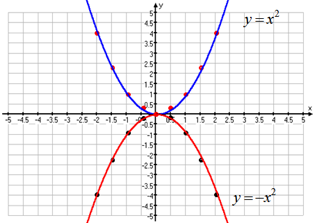
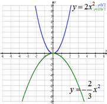
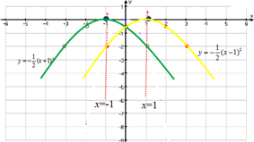
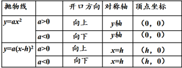
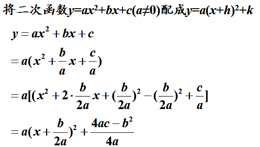
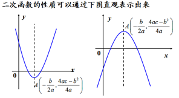
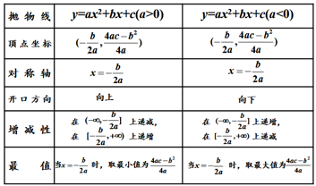

# 二次函数的图像及性质
#### $$y =x^2 和y =-x^2图像 $$

|抛物线|$$y =x^2 $$| $$y= -x^2$$|
|:---|:---|:---|
|顶点坐标|(0,0)|(0,0)|
|对称轴| Y轴| Y轴|
|位置|在X轴上方|在X轴下方|
|开口方向|向上|向下|
|增减性|在y左侧单调递增，在Y轴右侧单调递减|在Y轴左侧单调递增，在Y轴右侧单调递减|
|最值|x = 0，最小值| x = 0，最大值|

#### $$y = 2x^2和 y = -\frac{3}{2}x^2图像$$

1 抛物线y = ax 的顶点是原点，对称轴是Y轴
2 a决定了二次函数的开口大小和方向
* 当a>0时，y=ax^2图像在X轴上方（除顶点外）开口向上
* 当a<0时，y=ax^2图像在X轴下方（除顶点外）开口向下

|a|值越大开口越小

3.当a>0时，在y轴左侧函数单调递减，在y轴右侧函数单调递增，
 当x=0时函数y的值最小。
 当a<0时，在y轴左侧函数单调递增，在y轴右侧函数单调递减，
 当x=0时，函数y的值最大。

#### $$y =ax^2和 y =x(a-h)^2$$

当h>0时，y=a(x-h)2图象由y=ax2图象向右平移h个单位长度得到;

当h<0时，y=a(x-h)2图象由y=ax2图象向左平移︱h︱个单位长度得到

### 二次函数

## 二次函数表现形式
$$ y = ax^2  + bx + c$$
$$二次函数一般式 y = a(x+h)^2+k$$
$$二次函数顶点式 y = a(x+ \frac{b}{2a})^2 +\frac{4ac-b^2}{4a} $$
## 利用几何特征
要注意分类讨论
$$-\frac{b}{2a}$$==> 得出原顶点坐标==》求出顶点式
f(x+1) = f(x - 1) ==> (x -1)^2+c