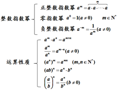
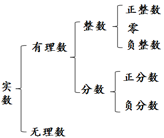
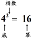
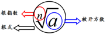

#指数与指数幂的运算

### 指数幂的概念

### 根式

#### n次方根定义：

如果一个数的n 次方等于 $$ a(n>1,n\in N^*$$),那么这个数叫做a的n次方根．
若xn=a,(n>1,n∈N＊)，则x叫做a的n次方根.

1, 当n为奇数时有一个:
$$a>0时,\sqrt[n]{a} > 0 （正数奇次方根是一个正数)$$
$$ a < 0 时,\sqrt[n]{a} < 0$$ （负数奇次方根是一个负数)

2, 当n为偶数时
$$a>0，\sqrt[n]{a}, -\sqrt[n]{a}有两个(互为相反数),即x = \pm\sqrt[n]{a}$$
$$ a<0$$，没有实数根（负数没有偶次方根)

3, 0的任何次方根都是0，记作$$\sqrt[n]{0} = 0$$
式子$$\sqrt[n]{a}$$ 叫做根式，这里n叫做根指数 ，a叫做被开方数．即：
