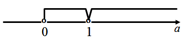
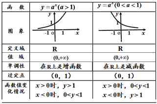

# 指数函数
1.指数函数定义：
形如y=ax(a>0且a≠1)的函数叫指数函数，其中x是自变量，函数定义域R. 
2.函数解析式三大特征：

* 指数是自变量x ；
* 底数是非1的正数；
* 系数为1

#### 探究:为什么要规定a>0且a≠1呢

若 $$a < 0,a^x$$不一定有意义,如 $$ a = －2,a^x =(-2)^\frac{1}{2}=\sqrt[]{-2} $$显然无意义 



若$$a=0，x>0时，a^x＝0，x≤0时，a^x$$无意义


若$$a=1，1^x＝1$$，没有研究的价值。

指数函数y=2x的图象和性质

1. 定义域: R ;

2. 值  域: ( 0 , +∞) ； 
3. 过  点: ( 0 , 1) ；
4. 单调性:在 R 上是增函数； 
5. 函数值的变化情况: 
当 x > 0时, y > 1.
当 x < 0时, 0< y <1.
函数y=ax(a>1)的图象特征与函数性质

### 函数y=ax(a>1)的图象特征与函数性质
|图象特征 |函数性质| 
|:--- | :---|
|向x轴的左右方向无限延伸 | 定义域（－∞，＋∞）|
| 图象不关于y轴和原点对称 | 非奇非偶函数 |
| 图象都位于x轴上方 | x∈R，都有a^x>0 | 
| 图象都经过（0,1）| a0＝1(a>0且a≠1) | 
| 在第一象限纵坐标都大于1 | x>0,ax>1 |
| 在第二象限纵坐标都小于1 | x<0,0<ax<1 |

