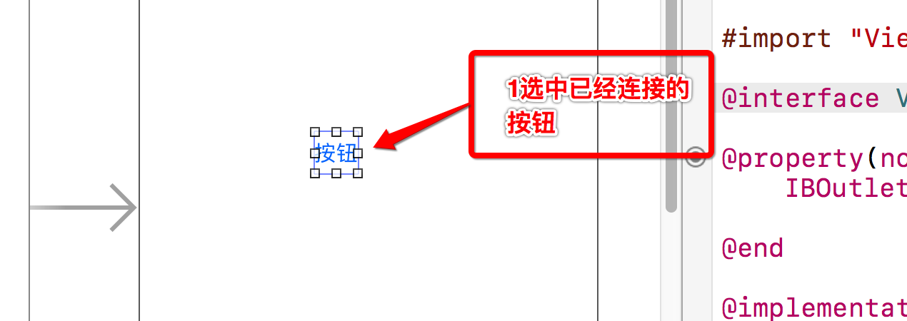
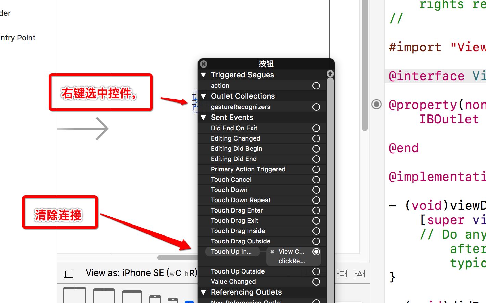
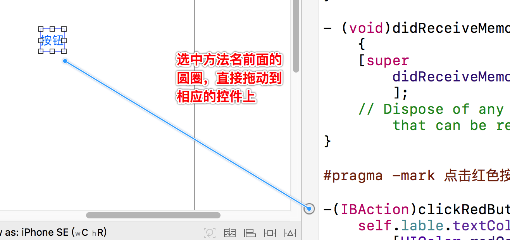
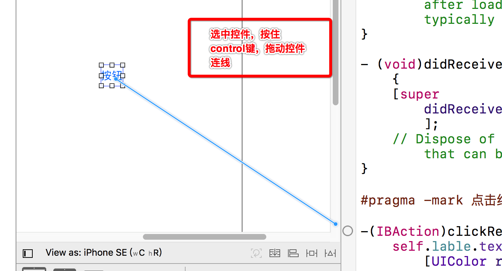
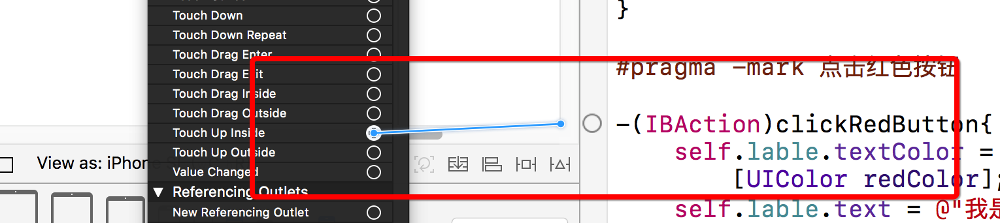
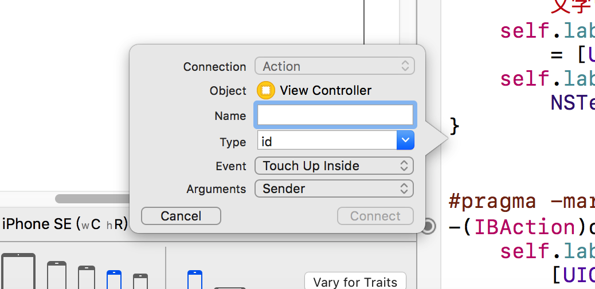

# UILable
### UILabe 属性
    ```objc
    // 改变文本中文字的颜色
        self.label.textColor = [UIColor redColor];
    // 改变文本的内容
        self.label.text = @"我是一段红擦擦的文字";
    // 改变背景的颜色
        self.label.backgroundColor = [UIColor blackColor];
    // 文字居中
        self.label.textAlignment = NSTextAlignmentCenter;
    // 改变文字的大小
        self.label.font = [UIFont systemFontOfSize:20.0];
     // 改变红色按钮的背景颜色
        self.redBtn.backgroundColor = [UIColor redColor];

    ```

### UI控件响应事件移除拖线连接

#### 第一步



#### 第二步



### UI控件响应事件拖线连接的三种方式

#### 第一种



#### 第二种



#### 第三种



### 可连线的UI控件直接拖到ControlView 的空白处，弹出创建方法对话框



### 注意

* 只有sendevent事件的对象才能连线方法
* 继承自UIControl对象的才能连线
* 一个控件可以对应多个事件 
* 一个控件也可以对应多个个属性，但尽量不要这么做

### 连线常见错误

####注意事项:
   1.凡是继承UIControl的类产生的对象,都能够实现点击
   2.如果不是继承UIControl的类产生的对象,都能不够实现点击
 
   经典的错误:
   一.错误一:
     描述: 
     reason: '[<MainViewController 0x7fd133746de0> setValue:forUndefinedKey:]: this class is not key value coding-compliant for the key testLabel.'
     原因: 有多余的连线
     解决: 删除多余的联系
 
  二.错误二
     描述:
     reason: '-[MainViewController clickRedBtn:]: unrecognized selector sent to instance 0x7f7f9254bee0'
     原因:在控制器中找不到对应的方法
     解决:  (一) 增加对应的方法  (二)删除多余的连线

---
# UIView

### UIView常见属性

    ```objc 
        @property(nonatomic,readonly) UIView *superview;
         获得自己的父控件对象
        
        @property(nonatomic,readonly,copy) NSArray *subviews;
         获得自己的所有子控件对象
        
        @property(nonatomic) NSInteger tag;
         控件的ID(标识)，父控件可以通过tag来找到对应的子控件
        
        @property(nonatomic) CGAffineTransform transform;
         控件的形变属性(可以设置旋转角度、比例缩放、平移等属性)
        - (void)addSubview:(UIView *)view;
         添加一个子控件view
        
        - (void)removeFromSuperview;
         将自己从父控件中移除
        
        - (UIView *)viewWithTag:(NSInteger)tag;
         根据一个tag标识找出对应的控件（一般都是子控件）
        
        - (void)loadView{
          [super loadView];
        //  NSLog(@"%s", __func__);
        }
        
        /*
           1.当控制器的view加载完毕的时候调用
           2.系统自动调用
           3.控件的初始化操作,数据的初始化
         */
        - (void)viewDidLoad {
            [super viewDidLoad];
        
            // 1.1 查看红色的View的父控件
        //    NSLog(@"红色的View:%@------控制器的View:%@", self.redView.superview, self.view);
            
            // 1.2 查看红色的View的子控件
        //    NSLog(@"红色的view的子控件:%@", self.redView.subviews);
            
            // 1.3 查看控制器的View的子控件
        //      NSLog(@"控制器的View的子控件:%@", self.view.subviews);
            
            // 1.4 控制器的view的父控件
              NSLog(@"%@", self.view.superview);
            
        }
        
        /*
           控制器的View已经完全显示
           系统调用
         */
        - (void)viewDidAppear:(BOOL)animated{
            [super viewDidAppear:animated];
            
            // 1.4 控制器的view的父控件 ---> UIWindow
            NSLog(@"%@", self.view.superview);
        }
        
        
        /*
          1. 当控制器接收到内存警告时候调用
          2. 系统自动调用
          3. 处理调用一些不必要的内存和一些耗时的内存
         */
        - (void)didReceiveMemoryWarning {
            [super didReceiveMemoryWarning];
        }

    ```


