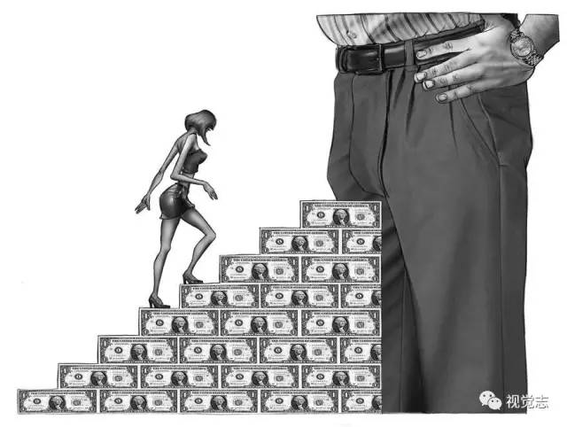

## 30幅赤裸裸的成人漫画，太扎心了！ {#activity-name}

_2017-07-22_

[小e每日英语](https://mp.weixin.qq.com/s?__biz=MjM5NTcwOTgwMQ==&mid=2651330826&idx=2&sn=a5e986493c8ff8f87420f2bb112a2b7e&chksm=bd08ef0c8a7f661a2b12cdf98b09ee50abf00cc4bbdb221fd15dbbdbbb30be474b2779025763&scene=0&key=ca249f4a458843b74e2b48bc51fb68445e1ebe7115e50f39b69070d6d87df570d5802a13daac53bb92f47b0a1f911caec7684d5a860d633bd4f0d6e44a140215edb50cada326106d41d1da9370047969&ascene=0&uin=MTI2OTgzMzMxNw%3D%3D&devicetype=iMac+MacBookPro11%2C1+OSX+OSX+10.12.5+build%2816F73%29&version=12020810&nettype=WIFI&fontScale=100&pass_ticket=Ymm%2FTHXObG0QS%2FNdJ0BcAEYus1Skgm8psno86CmsmLTglcjJRXgkIKnlcL20jR3%2F##)

  

社会就像一个大熔炉

每个人都在其中摩擦熔炼

努力改变着社会

也在被社会改变

插画家Al Margen

用一组暗黑系的作品

反映当下社会的面目

画的是他人

也是你我

画的是人性和社会

也是生活

  

 01 

现代职场工作繁重

每天都处于超负荷运转

  

 02 

重重压力下人们已经分不清

工作是为了活着

还是活着是为了工作

  

 03 

为了减肥可以不惜任何代价  

对身材的理解和追求已然病态

  

 04 

在这个社会没有金钱寸步难行

只能一步步沦为金钱的奴隶

  

 05 

每个人都有好几副面具

随时准备演绎变脸的戏剧

已经分不清是扮演的角色还是自我

  

 06 

在社交中也习惯以面具示人

虚伪客套的交际索然无味

却又不肯表现真正的自己

  

 07 

快餐知识比书本知识更让人感兴趣  

人们更愿意选择符合口味的肤浅电视剧

传统阅读已经被淡忘

  

 08 

明知道吸烟有害健康  

可是依旧沉迷于这种自杀方式

  

 09 

打着一切为了孩子的名义争吵  

孩子被灌输的只有父母的咆哮

  

 10 

不仅要承受父母争吵的痛苦  

孩子还要背负重重枷锁

被“兴趣特长”剥夺了自由

  

 11 

官方的发言  

有些不过是皮诺曹的故事

  

 12 

金钱至上  

有人甚至甘愿利用职场潜规则

换取金钱与荣华富贵

  

13 

现代化建筑的增多

不断冲击传统老建筑

  

 14 

艺术家只创造观众想要的音乐  

以失去自我为代价追求名利和财富

  

 15 

在社会这座大染缸中  

自由的思想很难再找回

  

 16 

虽然条条大路通罗马  

但是有些人始终找不到出路

生活就像个死胡同

  

 17 

一个家庭的悲剧  

是从因为钱而吵架开始的

  

 18 

网络成了生活的的枷锁  

生活和娱乐都被铐在互联网上

  

 19 

家庭暴力越来越普遍  

任何冲突都用铁拳解决

  

 20 

每天专注于成百上千的社交软件  

很少有时间享受大自然

  

 21 

快节奏生活下的快餐式相亲  

把两个不合适的人将就着凑在一起

只会促成一段不幸福的婚姻

  

 22 

每天都要考虑家庭，朋友，工作，生活各种问题

大脑不堪重负，每天活在崩溃焦虑中

  

 23 

盲目的爱情  

就是给对方一个伤害自己的机会

结果只会心碎

  

 24 

有些男人更多的关注女人的身体

而不是内涵

  

 25 

房价飞速上涨

住房问题越来越严峻  

  

 26 

人生如戏，戏如人生  

面对着生活的艰辛

只有用酒精麻痹自己

  

 27 

应试教育有时是创造力最大的杀手

  

 28 

体制之下，教育产业化  

很多人一毕业就失业

没有工作经验的人一文不值

只能用血泪支撑着自己的生活

  

 29 

（AYER在西班牙语译为昨天）

一味的关注过去，活在昨天  

只会让人变得尖钻刻薄

  

 30 

止步不前、害怕未来、沉迷于过去  

都不如面对现实，活在当下 

  

看完这些扎心的漫画

你是否被触动了？

  

